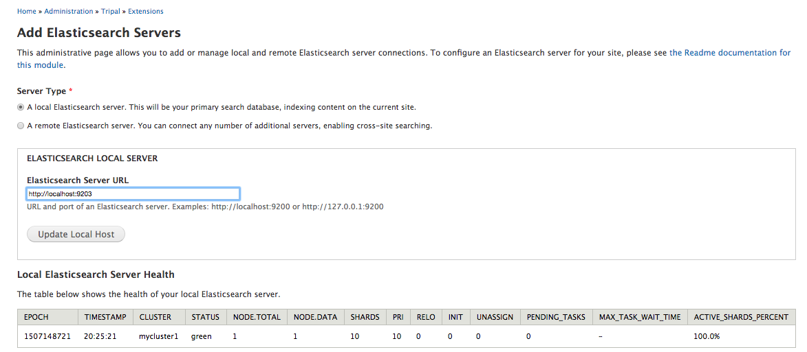
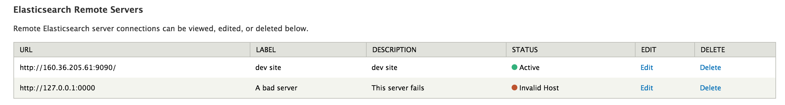

#Tripal Elasticsearch

The Tripal Elasticsearch module allows you to easily manage the indexing and display of Elasticsearch on your Tripal website.  It also easily enables Cross-Site Querying, allowing you to connect to other Tripal sites and provide additional search results to your users.

# Requirements
* Elasticsearch
* Elasticsearch-PHP library

## Install Elasticsearch

Please refer to this [page](https://www.elastic.co/guide/en/elasticsearch/reference/current/_installation.html) to install Elasticsearch.

## Install Elasticsearch-PHP library
* Create a folder named `elasticsearch-php` within your drupal 'sites/all/libraries' directory.
* Move into the `sites/all/libraries/elasticsearch-php` and Run the following command to install the library:
```
curl -s http://getcomposer.org/installer | php
php composer.phar require "elasticsearch/elasticsearch:~5.0"
```

For more details, go to https://www.elastic.co/guide/en/elasticsearch/client/php-api/current/_quickstart.html.

# Connecting to Elasticsearch Servers
The Tripal Elasticsearch module allows connections to local and remote servers.  Your local connection is the server for your own site: you will be able to manage your indices and the details of this cluster.  Note that your Elasticsearch server need not be hosted alongside your Tripal site: local means that is the service that indexes and searches **your Tripal site**.  Remote connections allow you to connect to other websites and include their search results on your Tripal site.  Remote services are managed on their respective sites.

## Connect to your local Elastic cluster

Go to `http://[your-tripal-site-domain]/admin/tripal/extension/tripal_elasticsearch` and 
enter the host and port of your elastic cluster.  Make sure that the Server Type radio button is set to **local**. For example, the image below shows that
the Elastic server is running on the same host as the Tripal site, and the port is 9203.



### Local Elasticsearch Server Health

This table provides feedback on the health of your connected local Elasticsearch Server.  If your connection is succesful, the Status column will be Green. For more information on the returned statistics, please see [the Elasticsearch documentation](https://www.elastic.co/guide/en/elasticsearch/reference/current/_cluster_health.html).

## Connect to a remote server

To add a new remote Elasticsearch server, select the Remote Server Type radio button,  fill out the server URL, Label, and Description, and press the Save Remote Host button. 

After connecting a remote server, it will be displayed in the remote server health table (example below).  If the connection is successful, the Status column will be green/Active and you can include this remote connection in your search interface.  If the status remains Red, ensure that you have the correct URL, and that your firewall is not blocking connections.  You may also edit and delete your remote servers using this table.



## Activating Cross Site Search
To enable cross site search, you'll need to enable the `Tripal Elasticsearch cross site search form` block and configure it to display on a page of your choice. Normally, this block should be placed in `Main Content` region. To make sure the block doesn't show up on all of your site's pages, you should configure it to display only in a specific page. See image below for an example where the block wil show up only on `/elasticsearch/cross-site`:


# Indexing

Once a local Elasticsearch server is connected, you will need to index data so that it is searchable. The index management interface is located at: `http://[your-tripal-site-domain]/admin/tripal/extension/tripal_elasticsearch/indices_management`

Please note that that the indices of remote Elasticsearch servers cannot be created or edited.

## Creating a new Index

You can create a new index by clocking on the create Index tab, or navigating to `http://[your-tripal-site-domain]/admin/tripal/extension/tripal_elasticsearch/indices_management/create`.  

For all index types, you need to:

* select a number of cron queues to utilize for the indexing job.
* select an index type.
* Decide if the index will be exposed to Cross-Site Search.

#### CRON queues

You can select up to 10 cron queues. Jobs in cron queues can be executed in parallel. For example, if you
have 1000 pages to index and you select 5 cron queues, 1000 indexing records will be generated and evenly 
distributed to the 5 cron queues. Then you will be able to set up 5 threads for parallel indexing.

#### Index types

There are three types of indices: Website nodes, Website entities, and Database tables.  The website-wide indices are intended to index all Tripal 2 or Tripal 3 content (and any other content on your site of that type), respectively, and cannot be configured beyond Token settings. Database table indices can be customized by indexing and displaying specific fields.

## Indexing database tables

The Tripal Elasticsearch module allows you to index any tables from the public and chado schema.
You can index all fields or a subset of fields from a table. You can select mapping types for each fields. 
Only fields that have a mapping type selected will get indexed and become searchable later. 

Database table indexing also allows you to specify **tokenizer** and **token filters**. 
If you are not familiar with these concepts, we recommend you select `standard` for 
tokenizer and `standard` for token filters. Below is an example:

 

# Parallel indexing with multiple threads

Drupal needs URL requests to trigger cron jobs. But you can manually set up cron jobs in your server.
To do this, you will need to know the cron job names triggered by Tripal Elasticsearch.

## Obtain cron job names

Go to `http://[your-tripal-site-domain]/admin/config/system/cron`. On this page, you will find
the 10 cron queues created by the Tripal Elasticsearch module. Hover the mouse over the **Run** link on the
right of each cron queue. At the bottom of the page, the URL will display. The cron job name is within
the URL. For example, the cron job name is `queue_elasticsearch_queue_1` in the example below:


## Add cron jobs to crontab file

* Open the crontab file:

```
crontab -e
```

* Add jobs to the file (Check [here](http://www.nncron.ru/help/EN/working/cron-format.htm) for more details on the cron job format):

```
*/5 * * * * drush cron-run queue_elasticsearch_queue_1 --options=thread=2 --root=/path/to/your/drupal/root
*/5 * * * * drush cron-run queue_elasticsearch_queue_2 --options=thread=3 --root=/path/to/your/drupal/root
*/5 * * * * drush cron-run queue_elasticsearch_queue_3 --options=thread=4 --root=/path/to/your/drupal/root
*/5 * * * * drush cron-run queue_elasticsearch_queue_4 --options=thread=5 --root=/path/to/your/drupal/root
*/5 * * * * drush cron-run queue_elasticsearch_queue_5 --options=thread=5 --root=/path/to/your/drupal/root
```

# Build search blocks

After your database tables get indexed, you can build a search interface for them.  Note that search blocks for node and entities are configured automatically and cannot be customized.  
You can choose to expose all table fields or a subset of fields for searching.

The admin page for building search blocks is at `http://[your-tripal-site-domain]/admin/tripal/extension/tripal_elasticsearch/search_form_management`.


You can configure the settings for each field in the search block.  Expanding the field's dropdown menu will allow you to change the title, description, field type, weight, and URL link.


## URL links

The URL link region of each field will let you configure URL links for that field. Linked fields can be static `(https://www.ncbi.nim.nih.gov)` or dynamic `(organism/[genus]/[species])`.

## Field types

The field type available to users in the search form. `textfield` indicates a text input box. `select` indicates a dropdown menu box. If this field contains more than 50 unique values in the database table, only the `textfield` will be available.

If you choose a `select` field type, you must provide **key|value pairs** to build the dropdown box.  The keys should be the true values in your database table, and the values can be anything that you want to show to your users. key|value pairs must be placed within brackets.  For example, `[key|value]`.


# Create, update and delete pages

Whenever you create a new page, update existing pages or delete pages, indexing jobs will automatically 
be added to the cron queues. When the indexing jobs get executed depends on how you configure cron jobs
on your Tripal site. If you need the updated indexing process to start immediately, you can always launch 
your cron jobs manually by going to `http://[your-tripal-site-domain]/admin/config/system/cron`. If you 
have added the crob jobs into the crontab file, then no extra work needs to be done.


