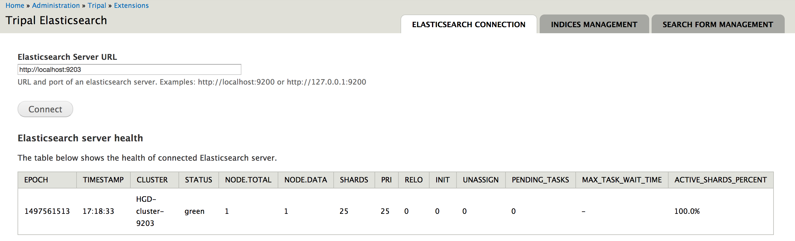
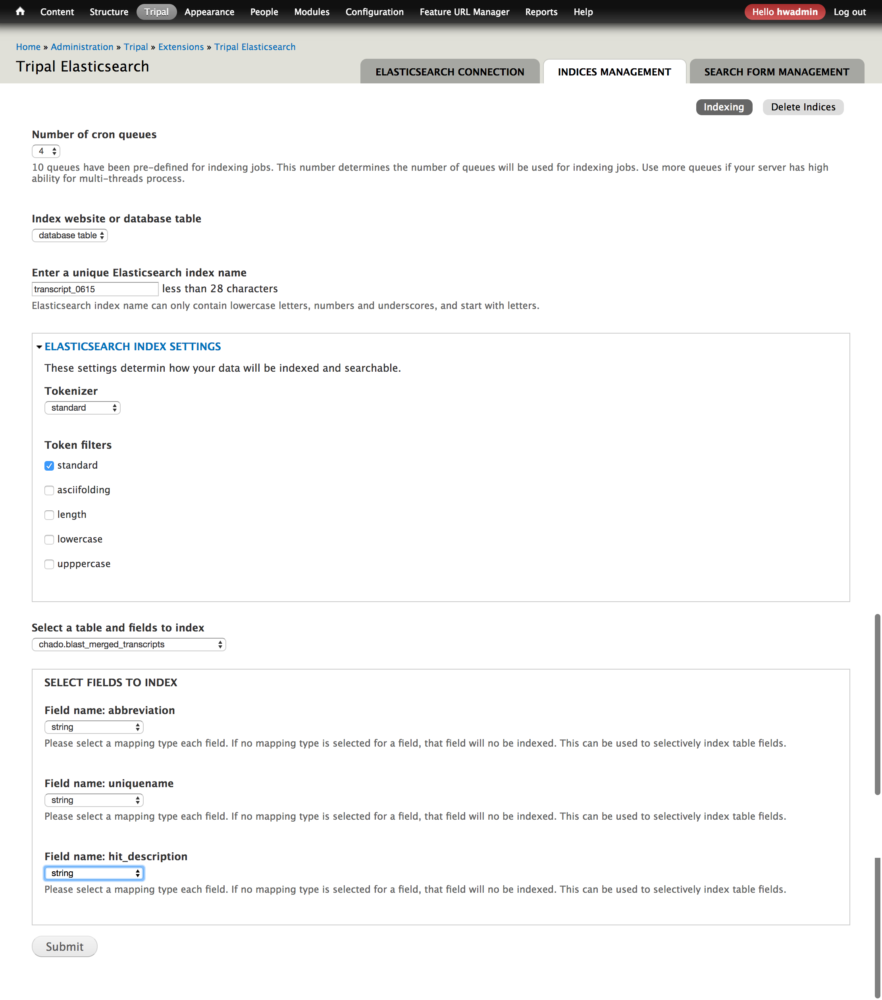
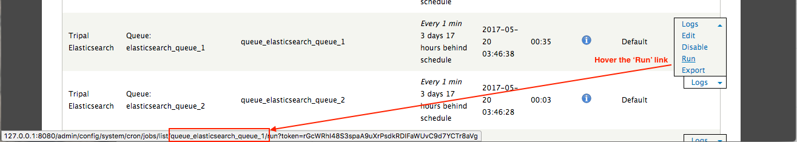
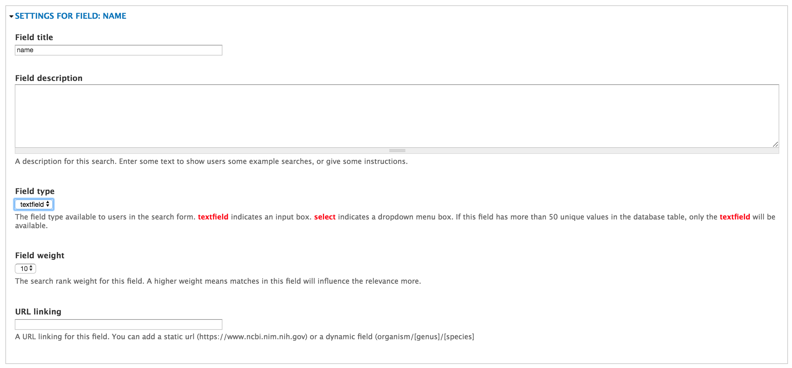
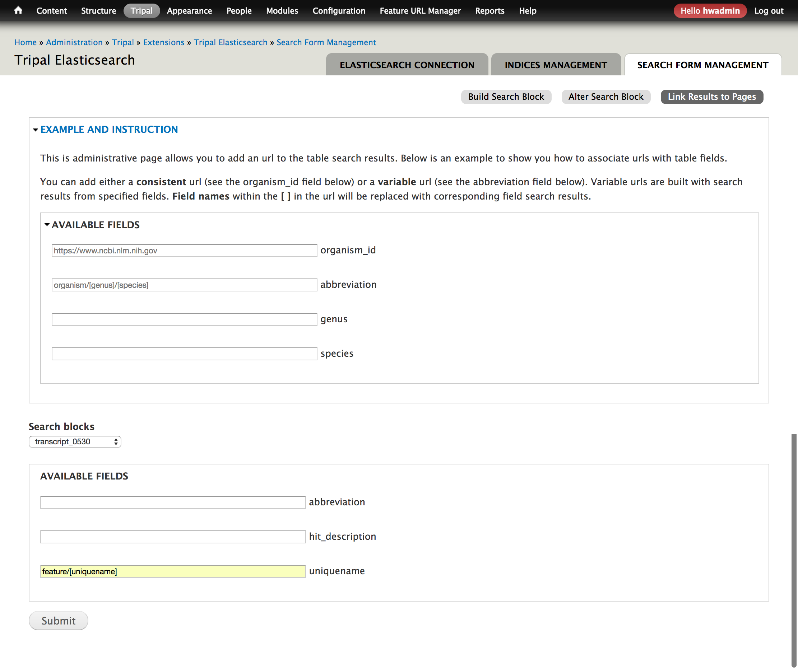

# Requirements
* Elasticsearch
* Elasticsearch-PHP library

## Install Elasticsearch

Please refer to this (page](https://www.elastic.co/guide/en/elasticsearch/reference/current/_installation.html) to install Elasticsearch.

## Install Elasticsearch-PHP library
* Create a folder named `elasticsearch-php` within your drupal 'sites/all/libraries' directory.
* Move into the `sites/all/libraries/elasticsearch-php` and Run the following command to install the library:
```
curl -s http://getcomposer.org/installer | php
php composer.phar require "elasticsearch/elasticsearch:~5.0"
```

For more details, go to https://www.elastic.co/guide/en/elasticsearch/client/php-api/current/_quickstart.html.

# Connect to Elastic cluster

Go to `http://[your-tripal-site-domain]/admin/tripal/extension/tripal_elasticsearch` and 
enter the host and port of your elastic cluster. For example, the image below shows that
the Elastic is running on the same host as the Tripal site, and the port is 9203.




# Indexing

Indexing interface: `http://[your-tripal-site-domain]/admin/tripal/extension/tripal_elasticsearch/indices_management`


## Indexing website

With website indexing, you need to:

* select a number of cron queues
* select `website`
* enter website base url.

You can select up to 10 cron queues. Jobs in cron queues can be executed in parallel. For example, if you
have 1000 pages to index and you select cron queues, 1000 indexing records will be generated and evenly 
distributed to the 5 cron queues. Then you will be able to set up 5 threads for parallel indexing.

## Indexing database tables


The Tripal Elasticsearch module allows you to index any tables from the public and chado schema.
You can index all fields or a subset of fields from a table. You can select mapping types for each fields. 
Only fields that have a mapping type selected will get indexed and become searchable later. 

Database table indexing also allows you to specify **tokenizer** and **token filters**. 
If you are not familiar with these concepts, we recommend you select `standard` for 
tokenizer and `standard` for token filters. Below is an example:

 

# Parallel indexing with multiple threads

Drupal needs URL requests to trigger cron jobs. But you can manually set up cron jobs in your server.
To do this, you will need to know the cron job names triggered by Tripal Elasticsearch.

## Obtain cron job names

Go to `http://[your-tripal-site-domain]/admin/config/system/cron`. On this page, you will find
the 10 cron queues created by the Tripal Elasticsearch module. Hover the mouse over the **Run** link on the
right of each cron queue. At the bottom of the page, the URL will display. The cron job name is within
the URL. For example, the cron job name is `queue_elasticsearch_queue_1` in the example below:



## Add cron jobs to crontab file

* Open the crontab file:

```
crontab -e
```

* Add jobs to the file (Check [here](http://www.nncron.ru/help/EN/working/cron-format.htm) for more details on the cron job format):

```
*/5 * * * * drush cron-run queue_elastic_queue_1 --options=thread=2 --root=/path/to/your/drupal/root
*/5 * * * * drush cron-run queue_elastic_queue_2 --options=thread=3 --root=/path/to/your/drupal/root
*/5 * * * * drush cron-run queue_elastic_queue_3 --options=thread=4 --root=/path/to/your/drupal/root
*/5 * * * * drush cron-run queue_elastic_queue_4 --options=thread=5 --root=/path/to/your/drupal/root
*/5 * * * * drush cron-run queue_elastic_queue_5 --options=thread=5 --root=/path/to/your/drupal/root
```

# Build search blocks

After your database tables get indexed, you can build a search interface for them.
You can choose to expose all table fields or a subset of fields for searching.

The admin page for building search blocks is at `http://[your-tripal-site-domain]/admin/tripal/extension/tripal_elasticsearch/search_form_management`.


The module also provides an admin page for altering search interfaces.



# Link search results to pages

The search results can be used to build URLs and link the results to particular pages 
through the admin page `http://[your-tripal-site-domain]/admin/tripal/extension/tripal_elasticsearch/search_form_management/link_results_to_pages`. 
For example:



# Create, update and delete pages

Whenever you create a new page, update existing pages or delete pages, indexing jobs will automatically 
be added to the cron queues. When the indexing jobs get executed depends on how you configure cron jobs
on your Tripal site. If you need the updated indexing process to start immediately, you can always launch 
your cron jobs manually by going to `http://[your-tripal-site-domain]/admin/config/system/cron`. If you 
have added the crob jobs into the crontab file, then no extra work needs to be done.


