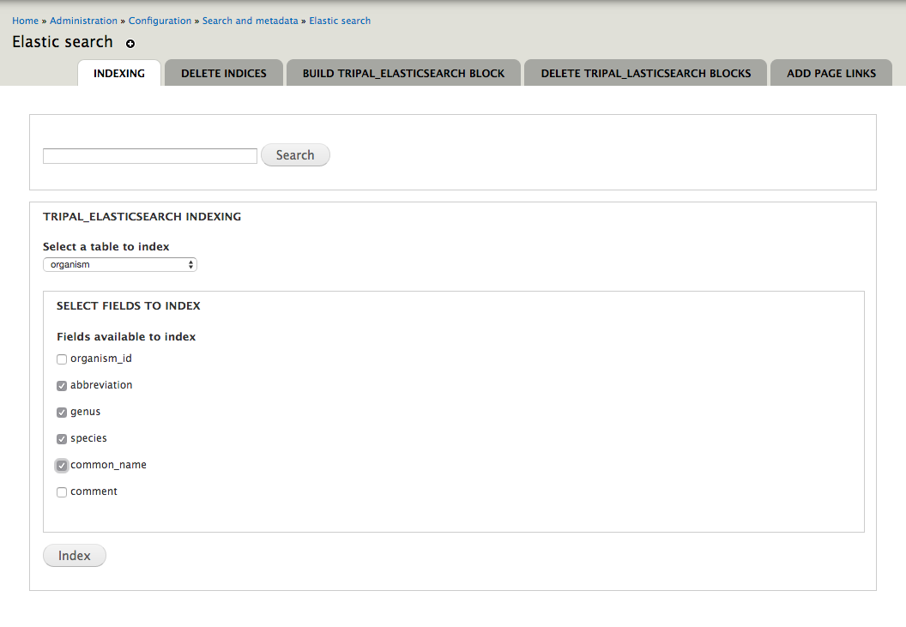
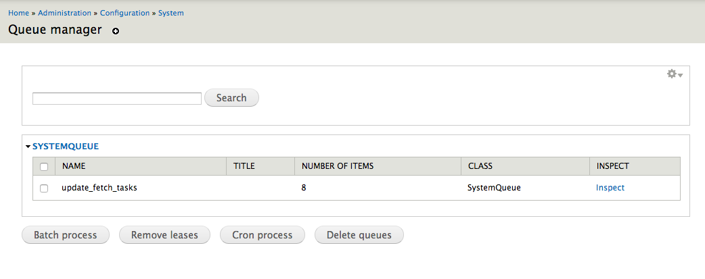
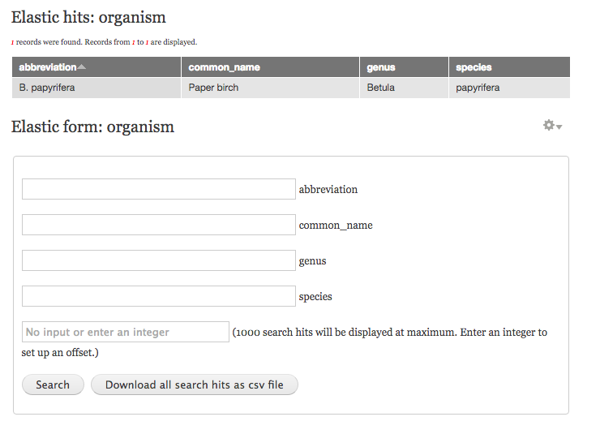
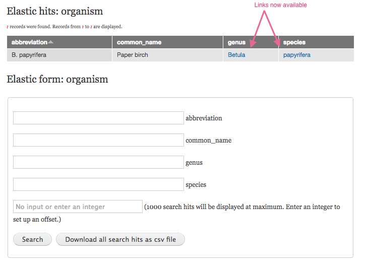

# tripal_elasticsearch

`tripal_elasticsearch` is a drupal module which integrates the powerful search engine [elasticsearch](https://www.elastic.co/) with drupal sites, providing general site-wide indexing and search, as well as specific indexing and search for any number of drupal and chado tables. It also provides an easy way to build search interface for individual drupal and chado tables after these tables are elastic-indexed. 

## The dependencies of `tripal_elasticsearch`
* The module `tripal_elasticsearch` depends on the search engine `elasticsearch`. Please follow [`the download and install directions`](https://www.elastic.co/downloads/elasticsearch) to run this module. 
* This module use `elasticsearch-php client` library to interact with `elasticsearch`. The normal elasticsearch install will come with the `elasticsearch-php client` library.

## Install elasticsearch
### Elasticsearch requires php version > 5.3.9

* check your php version: `php -v`

### Download elastic to your drupal site server
```
cd path/to/the/same/level/of/your/drupal/site/root
sudo wget https://download.elastic.co/elasticsearch/elasticsearch/elasticsearch-1.7.1.tar.gz
```

### Extract the files
```
tar -xvf elasticsearch-1.7.1.tar.gz
```

### Change the ownership of elasticsearch directory from `root` to `yourusername`
Elasticsearch doesn't run as root, so change the ownership from `root` to a different user.
```
chown -R username:username elasticsearch-1.7.1
```

### Configure `elasticsearch.yml`

* `cd elasticsearch-1.7.1/config`
* Open the configuration file: `vi elasticsearch.yml`
* Find the line starting with `#network.host:` and add `network.host: localhost` below it
* This is also your opportunity to change where elasticsearch puts the index files, which can be quite large. See the path.data config line.

### Start and stop elasticsearch
* To start: `cd elasticsearch-1.7.1` and `bin/elasticsdearch`
* To stop: `ctrl+c`

### [Run elasticsearch on the backgroud](https://www.elastic.co/guide/en/elasticsearch/reference/current/setup.html)
* `cd elasticsearch-1.7.1`
* `bin/elasticsdearch -d`

## Install `tripal_elasticsearch` module
* Install the module as a custom module: `cd sites/all/modules/custom`
* Download the module `wget https://github.com/tripal/tripal_elasticsearch.git`
* Run drush command to install: `drush en tripal_elasticsearch -y` (If you don't already have dependencies ultimate_cron and queue_ui, this will help you install them as well).

You can also fork the module from github and contribute to development.

__Currently this module has only been extensively tested on the [hardwood genomics database](http://hardwoodgenomics.org). We welcome feedback on any problems you have with using it on other sites.__

The module will enable two default blocks, one is a simple search box, the other is for more detailed queries. If you try to use them, they won't work yet. For them to work, you will need to create the index.

## Site-wide indexing
To implement a site wide search, the `tripal_elasticsearch` module indexes the content of every Drupal node. This includes much of the chado database content if it has been synced to Drupal. However, `tripal_elasticsearch` can also be used to directly index chado tables and thus to build very specific and customizable search interfaces based on the data from those chado tables. For the first example, we'll set up the site wide search.

* Go to __sitename.org/admin/config/elastic\_search__
* Select __index_website__ from the dropdown table list and then click on the "Index" button

You will see the page is loading. Do not close the page until the loading is finished. A cron queue is being created during this process. This may take one or two minitues depending on how many nodes your website has.


If the website has been indexed (like you see on the picture above), you may delete the index and then re-index it. To delete an index, go to __sitename.org//admin/config/search/elastic_search/delete_tripal_elasticsearch_indices__.

Once the cron queue is built, the site-wide indexing process will be automatically run by the cron jobs that you set up for Drupal. However, this is likely to be very slow. Below is more information on monitoring and speeding this process up.

### Monitor the number of items in the cron queue

Go to __sitename.org/admin/config/system/queue-ui__ to check how many items remaining in your elastic\_search cron queue. When no items left in the elastic\_search cron queue, the site-wide indexing process is finished.


### Run your elastic_search cron queue with multiple threads
With the help of the __ultimate_cron__ module, you can run a cron queue with multiple threads. This will significantly speed up the indexing process.

Go to __sitename.org/admin/config/system/cron/jobs/list/queue_elastic_queue/edit__ and select the number of threads you want to run


You may want to add additional cron jobs to your crontab file to continously trigger these jobs if your website doesn't have frequent requests. Below is an example:

* login to your server
* `crontab -e` to open the crontab file
* Add the command lines below to your crontab file. You may add more lines, depending on how many threads you set up.
```
*/5 * * * * drush cron-run queue_elastic_queue --options=thread=1 --root=path/to/you/drupal/site/root
*/5 * * * * drush cron-run queue_elastic_queue_2 --options=thread=2 --root=path/to/you/drupal/site/root
*/5 * * * * drush cron-run queue_elastic_queue_3 --options=thread=3 --root=path/to/you/drupal/site/root
*/5 * * * * drush cron-run queue_elastic_queue_4 --options=thread=4 --root=path/to/you/drupal/site/root
*/5 * * * * drush cron-run queue_elastic_queue_5 --options=thread=5 --root=path/to/you/drupal/site/root
*/5 * * * * drush cron-run queue_elastic_queue_6 --options=thread=6 --root=path/to/you/drupal/site/root
*/5 * * * * drush cron-run queue_elastic_queue_7 --options=thread=7 --root=path/to/you/drupal/site/root
```


Customized Searching of Specific Database Tables
------------------------------------------------
By indexing specific database tables, new types of searching are enabled: 
* select any tables from the drupal public databases or chado databases to index, regardless of whether or how they are synchronized as Drupal nodes
* index joined tables to combine data from different tables (for example, searching for features while filtering on organism)
* select specific fields from indexed tables for searching (for example, customize the feature search by an associated analysis and by keyword from the blast hit descriptions)

Here are the general steps:
* Go to __sitename.org/admin/config/search/elastic_search/tripal_elasticsearch_indexing__
* Select a table from the dropdown
* select fields from the table that you want to index
* click `Index` button


Next, build the search block for the indexed table
* Go to __sitename.org/admin/config/search/elastic_search/build_tripal_elasticsearch_block__
* Select a table from the dropdown. All the tables listed have been successfully indexed
* Select fields that you want to give users searching access
* Click 'Add elastisearch block' button
* Clear cache with drush command `drush cc all` or go to `sitename.org/admin/config/development/performance` and click `Clear all caches` button

All search blocks will be displayed on the `sitename.org/elastic_search` page by default. However, these blocks are configurable and can be moved to any other pages.  


### Example 1: Organism Search: 
Building a customized organism search block.
* Go to __sitename.org/admin/config/search/elastic_search/tripal_elasticsearch_indexing__
* Select the organism table from the dropdown
* Select fields from the table that you want to index, such as abbreviation, common name, genus, species
* Click `Index` button



You can see that the index job(s) is in the queue by going to __sitename.org/admin/config/system/queue-ui__. When there is no longer any job in the queue, the indexing is complete.



### Build search block for indexed tables
* Go to __sitename.org/admin/config/search/elastic_search/build_tripal_elasticsearch_block__
* Select a table from the dropdown and select the fields abbreviation, common name, genus, species
* Name the block organismSearch. 


This will create two blocks - one that holds the search form and one that holds the search results. By default, both are displayed on the `sitename.org/elastic_search` page only.

You can test the new search block on the `sitename.org/elastic_search` page. 


At this point, you will notice that a result is being returned, but the fields are not linked to the page you want (i.e., not clickable). We need to build paths from the search result fields to the correct site URL. For organisms, we know that the organism page is `sitename.org/organism/genus/species`

Navigate to __sitename.org/admin/config/search/elastic_search/tripal_elasticsearch_add_links__

Select the organism table. For each column of results, there is a text box. In that text box, you can build a URL to link to a Drupal page. You can specify how to use the results fields to build the URL. For example, the search results for organism include fields called 'genus' and 'species'. We can embed them in brackets to buld the URL that will always link to the page of interest:


Navigate to __sitename.org/elastic_search__ to check that the search box and results box are functioning and linking as desired.



### Example 2: Index joined fields from multiple tables
This example will build a transcript search block that allows the user to specify an organism, a blast hit description and/or a transcript unique name.

It is very common that we need to search/filter information from different tables and then display the results. `tripal_elasticsearch` allows you to do so very easily by indexing joined tables. First, you need to join the tables that contain the data that you want to index. As long as the joined table is in your public database or chado database schema, it will become visible on the dropdown table list. Then you can index the table normally.

There are many ways to join tables. An easy way for chado tables is to use the MViews module to create a materialized view. After you index the joined tables, you can delete them. Now we'll go through an example of indexing data from 3 chado tables (chado.feature, chado.organism, and chado.blast\_hit\_data). 

Create the materialized view. Visit __sitename.orgadmin/tripal/schema/mviews/new__ and fill out the form to create a materialized view called __search_features_all__.


For the array:
````
array (
  'description' => 'This view joins feature uniquenames to BLAST hit information (description, e-value, and hit score) and organism information (genus, species, common_name).',
  'table' => 'search_features_all',
  'fields' => array (
    'uniquename' => array (
      'type' => 'text',
      'not null' => true,
    ),
    'hit_description' => array (
      'type' => 'text',
      'not null' => true,
    ),
    'hit_best_eval' => array (
      'type' => 'text',
      'not null' => true,
    ),
    'hit_best_score' => array (
      'type' => 'text',
      'not null' => true,
    ),
    'common_name' => array (
      'type' => 'text',
      'not null' => true,
    ),
    'genus' => array (
      'type' => 'text',
      'not null' => true,
    ),
    'species' => array (
      'type' => 'text',
      'not null' => true,
    ),
  ),
)
````

For the SQL query:
````
SELECT f.uniquename AS uniquename, b.hit_description AS hit_description, b.hit_best_eval AS hit_best_eval, b.hit_best_score AS hit_best_score, o.common_name AS common_name, o.genus AS genus, o.species AS species
FROM 
chado.feature f
INNER JOIN chado.blast_hit_data b ON b.feature_id = f.feature_id
INNER JOIN chado.organism o ON f.organism_id = o.organism_id
````

After entering this information, click Add.  You then need to go to the list of materialized views and click "populate" for the data to be added to the table. After the cron job is run, the administrative page for Mviews will tell you how many records were added.

(In case you see no records - You'll notice this Mview uses the blast_hit_data table, which is only populated if you selected to add keywords when you added blast results). 

The rest of the instructions are now identical to indexing any other table for searching.

Do the indexing:
* Go to __sitename.org/admin/config/search/elastic_search/indexing__
* Select the search_features_all table from the dropdown
* Select fields from the table that you want to index, such as uniquename, hit_description, common name, genus, species
* Click `Elasticindex` button


