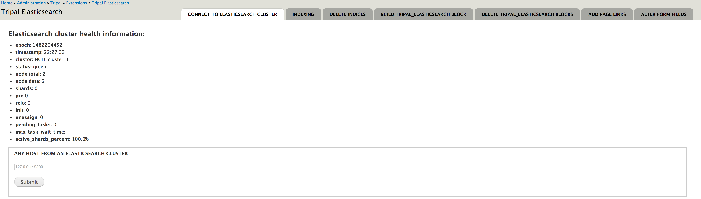
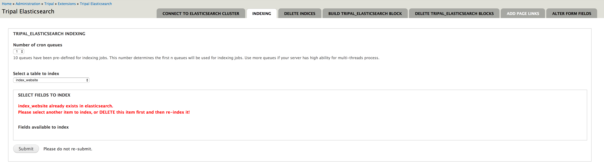
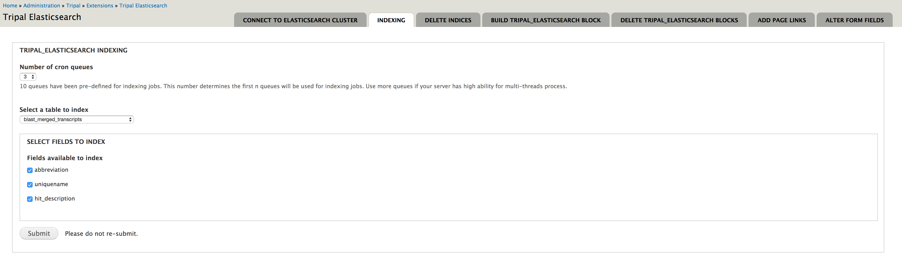
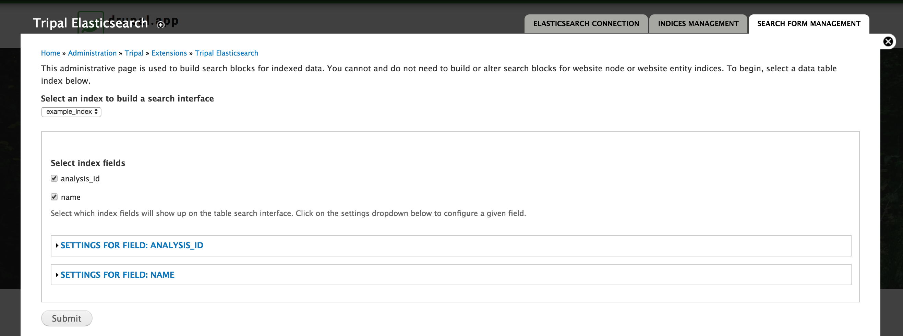
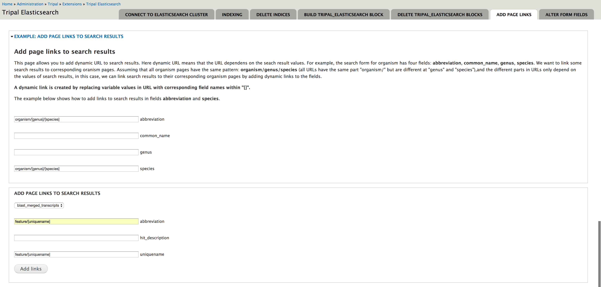
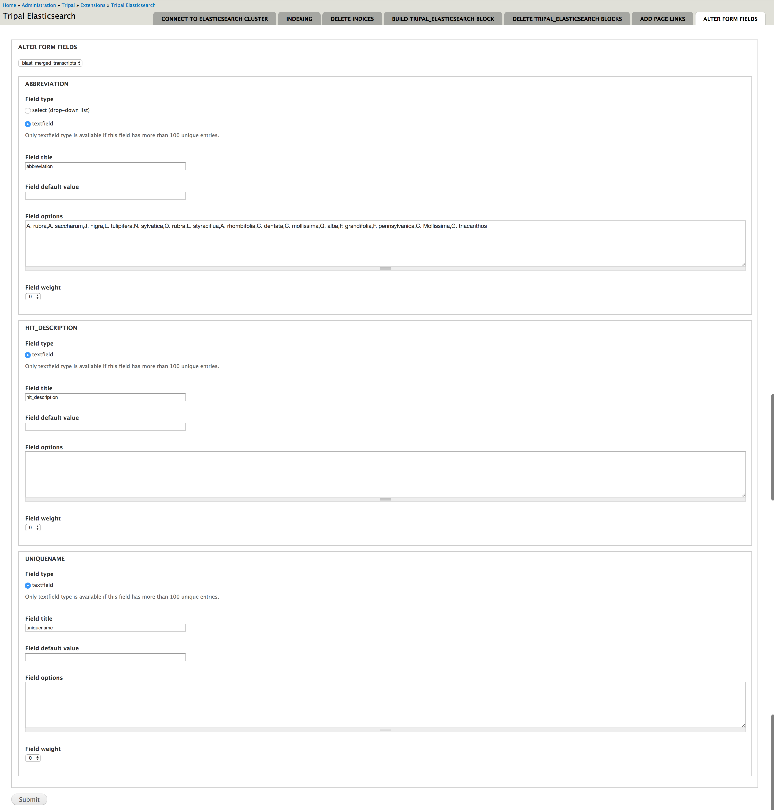

## Install tripal_elasticsearch module

Before you can use this module, you need to set up an elasticsearch cluster on either the same host as your drupal site, or on a different host or cloud. Please refer to [https://www.elastic.co/guide/en/elasticsearch/reference/current/install-elasticsearch.html](https://www.elastic.co/guide/en/elasticsearch/reference/current/install-elasticsearch.html) for setting up elasticsearch.

To install **tripal_elasticsearch**

```
cd drupal_root/sites/all/modules
git clone https://github.com/tripal/tripal_elasticsearch.git
drush en tripal_elasticsearch -y
```

## Connect to your running elasticsearch cluster

You will need the domain name or ip address of your elasticsearch host and the port. By default, the **tripal_elasticsearch** module will automatically connect to the elasticsearch cluster running on your local host with port 9200. You can change this using the admin page:
**admin/tripal/extension/tripal_elasticsearch/connect_to_elasticsearch_cluster**



If the cluster is successfully connected, the cluster health information will display.

## Index the entire website

To index the entire website, you go to **admin/tripal/extension/tripal_elasticsearch/tripal_elasticsearch_indexing** and select *index_website* and then submit. You can select up to 10 cron queues. For website indexing, the published node ids are obtained from the database. Then the corresponding html code is extracted and deparsed to generated strings for indexing. Sequences strings are excluded from indexing since they are meaningless. If you have 1,000,000 published nodes on your website, and you index the website with 5 cron queues, 1,000,000 will be generated and evenly distributed to the 5 cron queues. Then you will be able to set up 5 threads for parallel indexing.



If the index already exists, and you re-index without deleting the existing index, you will generate redundant data for that particular index.

## Index specific database tables

You can also select a table from the database to index. And you can specify which fields from that table you want to index. Below is an example of indexing a joined table which consists of data from chado.feature, chado.organism and chado.blast_hit_data. 




## Parallel indexing with multiple threads

Drupal needs URL request to trigger cron jobs. But you can manually set up cron jobs in your server.

* Edit the crontab file:

```
crontab -e
```

* Add the following jobs to your crontab file (assume that you select 5 cron queues when submitting the indexing form)

```
*/5 * * * * drush cron-run queue_elastic_queue_0 --options=thread=1 --root=/path/to/your/drupal/root
*/5 * * * * drush cron-run queue_elastic_queue_1 --options=thread=2 --root=/path/to/your/drupal/root
*/5 * * * * drush cron-run queue_elastic_queue_2 --options=thread=3 --root=/path/to/your/drupal/root
*/5 * * * * drush cron-run queue_elastic_queue_3 --options=thread=4 --root=/path/to/your/drupal/root
*/5 * * * * drush cron-run queue_elastic_queue_4 --options=thread=5 --root=/path/to/your/drupal/root
```

These will run the cron jobs every 5 minites. 


## Monitoring indexing process

There are several ways that you can check your indexing process goes.

1. Go to **admin/reports/dblog** and select *Tripal elasticsearch: indexing*
2. Go to **admin/config/system/queue-ui** to see the number of remaining items in each queue.
3. Use the command line below in the server that hosts your elasticsearch cluster to display the number of documents in each index.

    ```
    curl elasticsearch_cluster_domain:port/_cat/indices?v
    ## example
    curl localhost:9201/_cat/indices?v
    ```


## Build search block

Once the index is created and has some documents in it, you can build a search block for it. You don't have to wait for the indexing process to be complete. 

Go to **admin/tripal/extension/tripal_elasticsearch/build_tripal_elasticsearch_block** and select a table. After you select a table, you are allowed to select which indexed fields from that table you want to show to website users for searching. 



The search block is in a drupal block and will be displayed on the page *your.drupal.site/elastic_search* by default. You may need to clean the cache to display the block. A paired block will be automatically created to display the search outputs. These are normal drupal blocks and therefore configurable.

Blocks can be deleted through the admin page: **admin/tripal/extension/tripal_elasticsearch/delete_tripal_elasticsearch_blocks**

## Link search results to pages.

The search results can be used to build URLs and link the results to particular pages through the admin page **admin/tripal/extension/tripal_elasticsearch/tripal_elasticsearch_add_links**. For example:

.

All the feature pages have a fixed pattern of URL: *feature/[uniquename]*. The URL only varies on the *[uniquename]* and is a formula of the field values.

## Alter form fields

By default, all generated search blocks use text input box for each field. However, you can change the input box to a dropdown through the admin page **admin/tripal/extension/tripal_elasticsearch/tripal_elasticsearch_alter_form**. You can also change the labels and order of fields.


