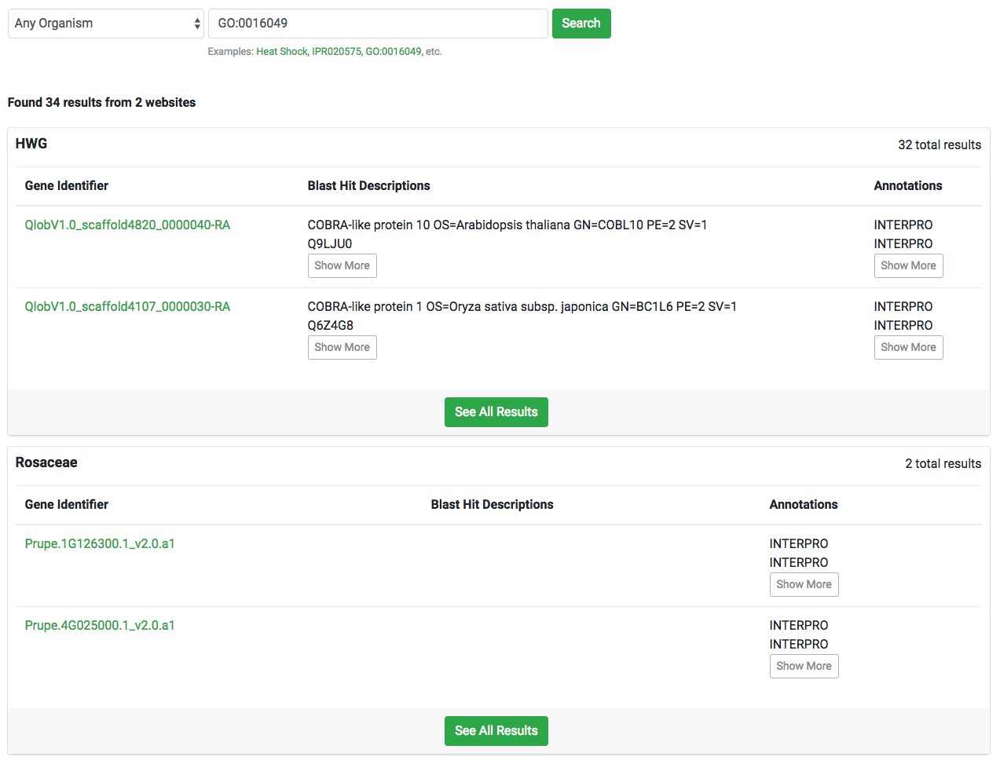

# Cross Site Searching
Tripal Elasticsearch provides an API that allows multiple sites to communicate with each other and share search results.
See example below of two sites returning results to a single page.

## Activating Cross Site Search
Cross site search is currently available for default indices only (website nodes and website entities along with gene search).

### Website Nodes and Entities

To enable cross site search, you'll need to enable the `Tripal Elasticsearch cross site search form` block and configure
it to display on a page of your choice. Normally, this block should be placed in `Main Content` region. To make sure
the block doesn't show up on all of your site's pages, you should configure it to display only in a specific page. See
image below for an example where the block wil show up only on `/elasticsearch/cross-site`:

### Gene Search Index
Similarly, you can activate the gene search index for cross site querying by enabling the `Tripal Elasticsearch cross site gene search form`.
However, unlike website indices, the gene search index requires the `Tripal Elasticsearch local gene search form` block
to also be active and setup to be displayed on a certain page by providing a url (see above for an example). The local gene
search form block is responsible for displaying results from your site only and it is where the user gets redirected to
when they click the `see all results` link.

Once the local block is activated and placed in a page, you must edit the gene search index from the Indices Management page
to provide the url path to the block.