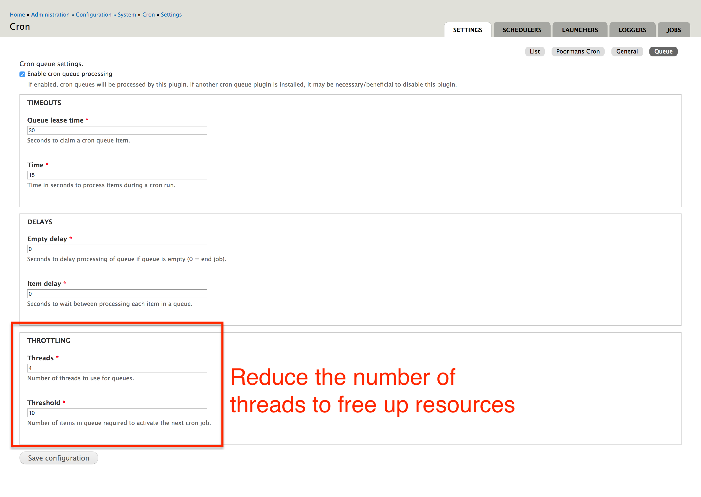

**Previous Section:** [Deleting Indices and Queues](manage_queues.md)

# System Resources Management

The Elasticsearch server can consume a great deal of system resources (RAM, Disk, etc) when 
not configured correctly. In this section, we'll explore possible solutions to limiting
what resources ES is allowed to use.

## Elasticsearch Java Virtual Machine Settings

By default, Elasticsearch reserves 2GB of heap memory for it's operations. If your server cannot
accommodate this much memory, you can customize this to as little as 512MB in `jvm.options`. 

**Note:** To find where the `jvm.options` file resides, please visit the [elasticsearch documentation](https://www.elastic.co/guide/en/elasticsearch/reference/current/jvm-options.html).
In most installations, `jvm.options` can be found in `/etc/elasticsearch/jvm.options`.

The options that control the heap size are formatted as such: 
```
# Sets the initial heap size
-Xms4g

# Sets the maximum heap size
-Xmx4g
```

You can change the size by editing the suffix of each options. For example, to set the heap size to 512MB,
change the options to look like this:
```bash
-Xms512mb
-Xmx512mb
```

You should always set the initial and maximum options to have the same value.

## Drupal Queue Settings

In the queue settings, you can adjust how many threads are allowed run at any given time. Reducing
the number of threads frees up more resources in your system. Visit `/admin/config/system/cron/settings/queue`,
to adjust the settings. See image below for an example.


